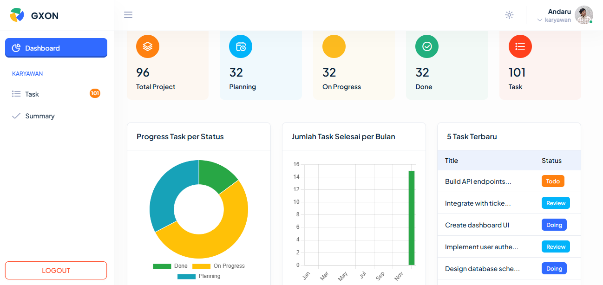
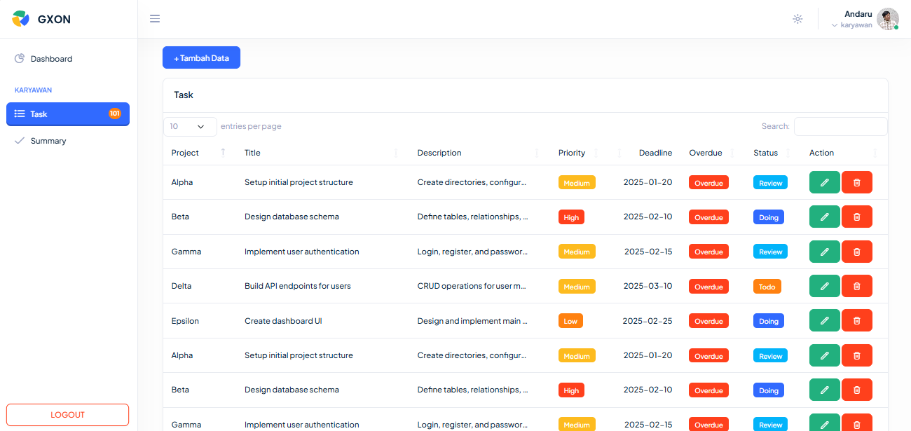
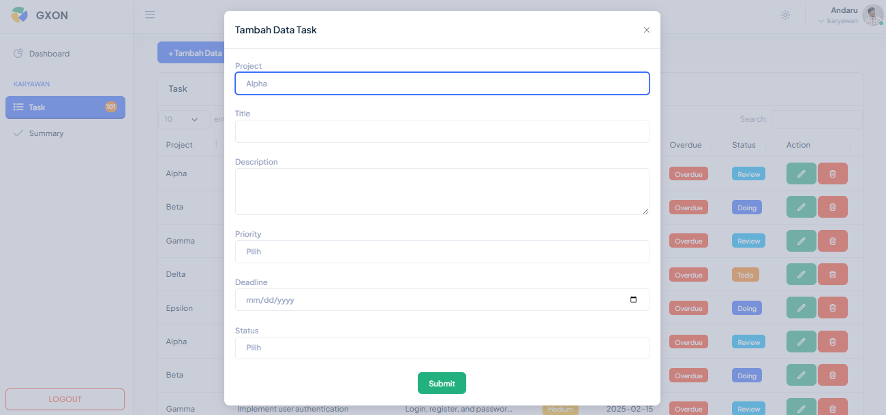
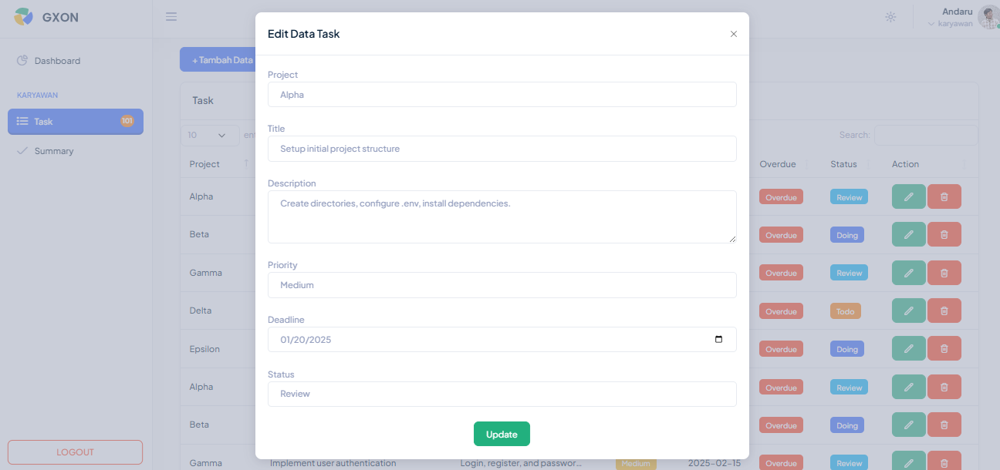
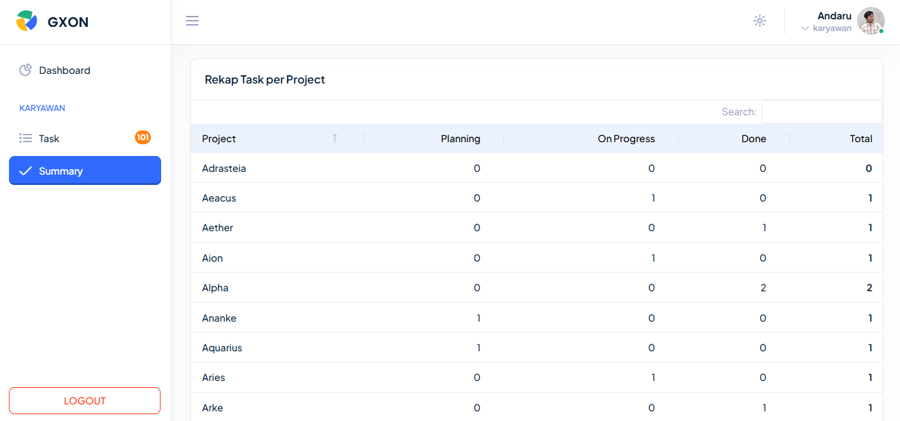
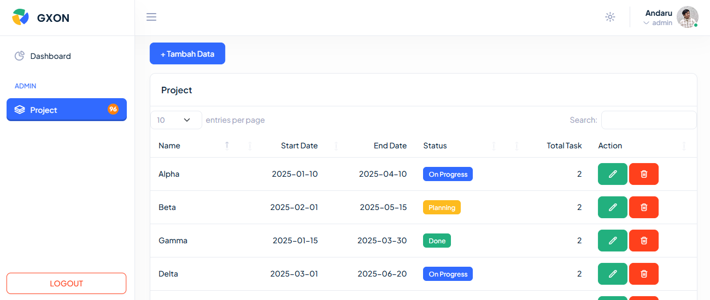
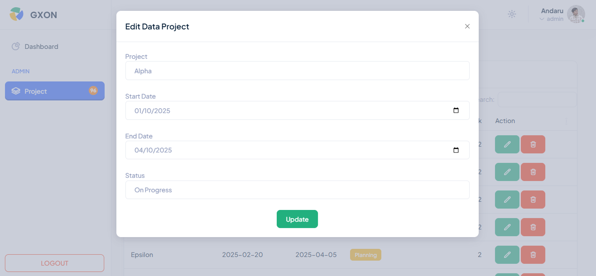
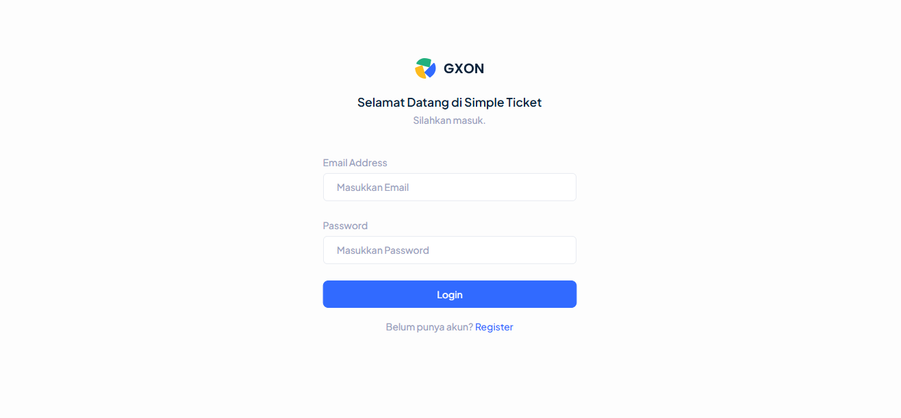
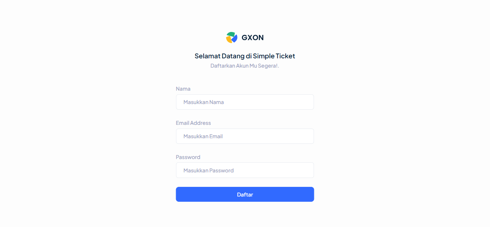

## Tentang Simple Ticket
Simple ticket adalah aplikasi sederhana ticketing untuk per-orangan. Dibuat menggunakan Bootstrap, jQuery, Laravel 12, dan MySQL.
## Role
1. Admin: Membuat project beserta deadline dan status.
2. Karyawan: Mengerjakan task sesuai dengan deadline.
## Screenshot Aplikasi
### Admin
Dashboard (Bisa untuk karyawan maupun admin.

### Karyawan

### Login

### Register

